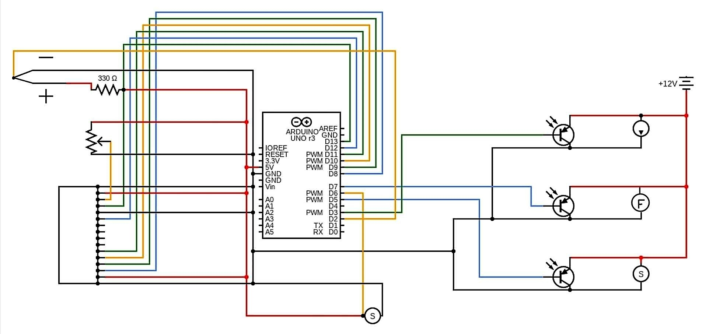

# Hot-Cocoa-Maker-BAE305
Final project for BAE 305 (TJ Wink, Luke Huesman, and Kate Moore)

## Summary

The purpose of this project was to create an automatic hot cocoa maker. All that is required for the user is putting cocoa mix in the funnel and flipping the switch for the water heater after it is filled with water. Once the water is heated to 165 degrees Fahrenheit, it will then pump the water into the cup. This process is followed by dumping the powder in and stirring the mix by using magnets. Overall, the process takes roughly 5 minutes to complete when water is warmed from room temperature. 

## Design Description

### Supplies

- Arduino Uno
- Laptop with capability to run Arduino code
- 12V laptop charger
- LCD screen
- (however many wires you used) wires
- Water Pump (idk specs)
- (2) 6 mm silicone tubes
- Electric water kettle
- 3? transistors
- Coffee cup
- ? Resistors
- BLDC Fan
- (2) rare earth magnets
- (1) magnetic stirring bar
- (whatever the motor used on the funnel is called)
- Funnel (3D printed for our project)
- Wood for hot cocoa stand

(note all components are rated for 12V, ? A)

### Wiring Diagrams

^all you gotta do is change is the name and the pic should pop up, TJ could you talk ab the circuit?

## Test Description

Testing involved troubleshooting the following items:
- LCD screen function
- Thermocouple testing
- Electric kettle function
- Water pump testing
- BLDC fan testing
- Magnet stir testing

#### **LCD screen function**

#### **Thermocouple testing**

#### **Electric kettle function**

#### **Water pump testing**

#### **BLDC fan testing**

#### **Magnet stir testing**

## Code Overview

## Part Analysis

### Project Discussion

## Results
