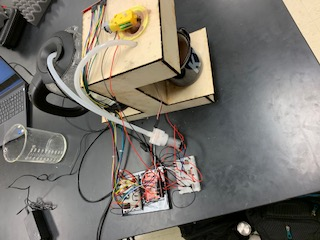

# Hot-Cocoa-Maker-BAE305
Final project for BAE 305 (TJ Wink, Luke Huesman, and Kate Moore)

## Summary

The purpose of this project was to create an automatic hot cocoa maker. All that is required for the user is putting cocoa mix in the funnel and flipping the switch for the water heater after it is filled with water. Once the water is heated to 165 degrees Fahrenheit, it will then pump the water into the cup. This process is followed by dumping the powder in and stirring the mix by using magnets. Overall, the process takes roughly 5 minutes to complete when water is warmed from room temperature. 

## Design Description

### Supplies

- 1 Arduino Uno
- 1 Laptop with capability to run Arduino code
- (however many wires you used) wires
- 

## Wiring Diagrams

## Test Description

## Code Overview

## Part Analysis

### Project Discussion

## Results
