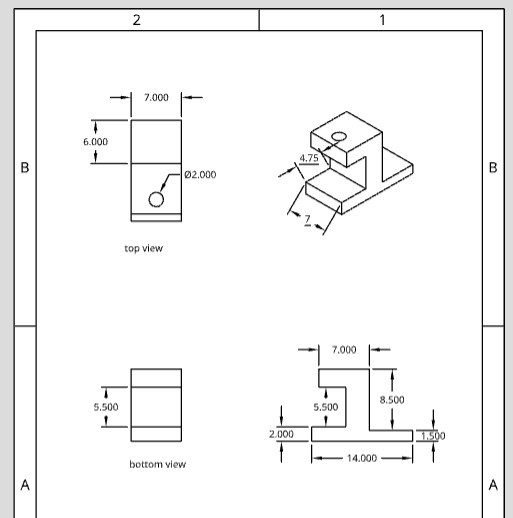
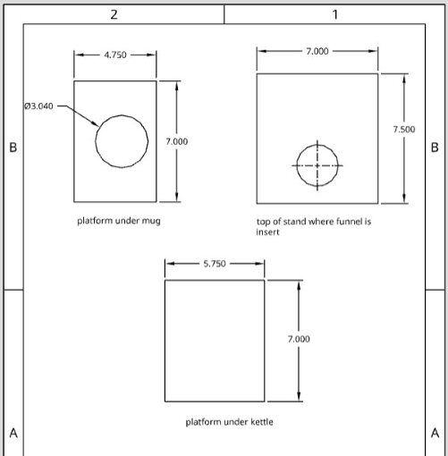

# Hot-Cocoa-Maker-BAE305
Final project for BAE 305 (TJ Wink, Luke Huesman, and Kate Moore)


## Summary

The purpose of this project was to create an automatic hot cocoa maker. All that is required for the user is putting cocoa mix in the funnel and flipping the switch for the water heater after it is filled with water. Once the water is heated to 165 degrees Fahrenheit, it will then pump the water into the cup. This process is followed by dumping the powder in and stirring the mix by using magnets. Overall, the process takes roughly 5 minutes to complete when water is warmed from room temperature. 


## Design Description

### Supplies

- Arduino Uno
- Laptop with capability to run Arduino code
- 12V laptop charger
- LCD screen
- Wires
- Water Pump (self priming, 12V)
- (2) 6 mm silicone tubes
- Electric water kettle
- 3 transistors
- Coffee cup
- 1 Resistor
- BLDC Fan (12V)
- (4) rare earth magnets
- (1) magnetic stirring pill
- 2 servo motors
- Funnel (3D printed for our project)
- Wood for hot cocoa stand
- Potentiometer

(note all components are rated for 12V, 120V AC)

### Wiring Diagrams


The circuit was used to operate 6 major pieces in the group project cocoa machine these pieces included a thermocouple, LCD screen (controlled by a potentiometer for brightness), servo motor, motor, computer fan, and a pump. The pump, computer fan, motor where all assisted by a 3 prong transistor since the each where powerd by a 12V power source, these transistors where used to feed the components to seperate pins in the arduino board. The process of learning how each component in the circuit operated was a fantastic learning experience, the most difficult learning curve for the group was the understanding of the transistors functionality. The fuinctionality of these transistors allowed us the opportunity to still wire the components to pin fuction on the arduino while also using an outside power source (wall plug-in) to power more intesive components for better functionality of our cocoa machine.

## Test Description

Testing involved troubleshooting the following items:
- LCD screen function
- Thermocouple testing
- Electric kettle function
- Water pump testing
- BLDC fan testing
- Magnet stir testing

#### **LCD screen function**

To test the functionality of the LCD screen, our group ran the "Hello, world!" code given by the Arduino website. This was a simple test to troubleshoot and ensure the LCD screen did not have any malfunction in display. 

#### **Thermocouple testing**

To make sure the thermocouple was detecting temperature properly, our group ran code given by the Arduino website for our specific thermocouple. 

#### **Electric kettle function**


#### **Water pump testing**


#### **BLDC fan testing**


#### **Magnet stir testing**


## Code Overview

Our code was structured to run all of our functions off of one switch. To perform this, our code made a series of if statements, with a function to conduct the brewing process if the temperature reached over 165 degrees Fahrenheit.

Below is our initialized variables, which contain floats and integers

```c
float voltage = 0;                          //the voltage measured from the TMP36
float degreesC = 0;                         //the temperature in Celsius, calculated from the voltage
float degreesF = 0;                         //the temperature in Fahrenheit, calculated from the voltage

const int RELAY_PIN_PUMP = 3;                    // the Arduino pin, which connects to the IN pin of relay
const int RELAY_PIN_FAN = 6;                     // the Arduino pin for the fan
const int RELAY_PIN_STIR = 7;                    // the Arduino pin for the stirrer

int haveIbrewed = 0;
int haveIpumpedWater = 0;
int haveIdumpedMix = 0;
int haveIemptiedMix = 0;
int haveIstirred = 0;
int startBrewing = 0;
```

The integers that equal 0 assign tasks that when completed, will equal 1. Constant integers establish the pump, fan, and stirring motor pins respectively. The following code block represents how we printed the degrees on the arduino be reading the temperature from the thermocouple.

```c
void loop() {
 
  sensors.requestTemperatures();                                 //Send the command to get temperatures
  lcd.setCursor(0, 0);                                           //set cursor to the upper left position
  lcd.print("Degrees F: ");                                      //Print "Degrees F: " 
  lcd.print((sensors.getTempCByIndex(0) * 9.0) / 5.0 + 32.0);    //print the temperature in Fahrenheit
  degreesF = (sensors.getTempCByIndex(0) * 9.0) / 5.0 + 32.0;    //Make temperature a varible called degreesF
  delay(500);              
  ```
  
  If the temperature read was between 80 and 165 degrees Fahrenheit, the LCD screen would display the temperature and that it is brewing. 
 
 ```c
 if (degreesF >= 80 && degreesF < 165){                         //if temp is equal to or above 80 and below 165
    
    lcd.setCursor(0, 0);                                         //set the cursor to the upper left position
    lcd.print("Degrees F: ");                                    //Print a label for the data
    lcd.print((sensors.getTempCByIndex(0) * 9.0) / 5.0 + 32.0);  //print the degrees Fahrenheit

    delay(500);                                                  //wait half a second

    lcd.setCursor(0, 1);                                         //set the cursor to the lower left position
    lcd.print("Heating...");                                     //Print that water is heating
  }
    else if (degreesF >= 165){                                    //if temp is greater than or equal to 165
      lcd.setCursor(0, 0);                                        //set the cursor to the upper left position
      lcd.print("Degrees F: ");                                   //Print a label for the data
      lcd.print((sensors.getTempCByIndex(0) * 9.0) / 5.0 + 32.0); //print the degrees Fahrenheit

      delay(500);                                                 //wait half a second
```      

Once 165 degrees Fahrenheit is reached, a series of if statements is triggered that will run the brewing process one after another. This includes pumping the water for the cup, dumping powder in, stirring powder out of funnel, and stirring in a sequencial order. At the end, "Done!" will be displayed on the LCD screen to indicate to the user that their hot chocolate is complete. Throughout each if statement, the variable assigned to each task is labeled as 1 to state to the arduino that the task is complete. This was done to ensure that the process does not run again as it is in a loop.

```c
else if (degreesF >= 165){                                    //if temp is greater than or equal to 165
      lcd.setCursor(0, 0);                                        //set the cursor to the upper left position
      lcd.print("Degrees F: ");                                   //Print a label for the data
      lcd.print((sensors.getTempCByIndex(0) * 9.0) / 5.0 + 32.0); //print the degrees Fahrenheit

      delay(500);                                                 //wait half a second
      
      if (startBrewing == 0){
        lcd.setCursor(0, 1);                                        //set the cursor to the lower left position
       lcd.print("Brewing...");                                    //Print that water is pumping
       delay(500);                                                 //wait half a second
       startBrewing = 1;
      }
      
      
      if (haveIbrewed == 0){
        digitalWrite(RELAY_PIN_PUMP, HIGH);                              // turn on pump 10 seconds
        delay(10000);
        digitalWrite(RELAY_PIN_PUMP, LOW);                               // turn off pump
        haveIbrewed = 1;
        }
      if (haveIdumpedMix == 0){
        myservo.write(90);
        delay(2000);
        myservo.write(0);
        delay(2000);
        haveIdumpedMix = 1;
        }
      if (haveIemptiedMix == 0){
        digitalWrite(RELAY_PIN_STIR, HIGH); // turn on stirrer 10 seconds
        delay(10000);
        digitalWrite(RELAY_PIN_STIR, LOW);  // turn off stirrer
        delay(1000);
        haveIemptiedMix = 1;
      }
      if (haveIstirred == 0){
        analogWrite(RELAY_PIN_FAN, 90); // turn on fan 30 seconds at 90/255 power
        delay(30000);
        analogWrite(RELAY_PIN_FAN, 0);  // turn off fan 
        delay(1000);
        haveIstirred = 1;
        lcd.clear();
        lcd.setCursor(0, 1);
        lcd.print("Done!");
        delay(20000);  

    }
    ```
    
    If there is none of the following detected (in other words if the temperature detected is under 80 degrees) it will display "STAND BY" on the LCD screen.
    
    ```c
     else{
      lcd.setCursor(0, 1);                                     //set the cursor to the upper left position
      lcd.print("STAND BY");                                   //Print that it is waiting for water to heat up
      delay(1000);                                             //wait a full second
```

Since the program is stored in the Arduino, the process can be reset by hitting the reset button on the Arduino. This allows for only that button to be pressed to start the process of making hot cocoa without running the code again.

    

## Part Analysis

### Water Pump

This was used to move water from the electric kettle to the coffee cup. The water had to be able to handle 12 V, an input and output valve, run for at least 8 seconds to get enough water in the cup. The pump laid next to the stand with one end of silicon tubing going into the ketttle and one end going into the cup. The pump works and codes very similar to a motor in Arduino. This allowed easy integration and implementing into our system after testing for how long the pump would stay on to fill the cup. One thing to consider with the pump is the pump rate since too fast of a pump rate (> ~3 ounces per second) would cause water to spill.

### Silicon Tubes

The two main factors to consider when selecting the tubing was it needed to fit the outlet of the water pump and be able to withstand hot water (in our case, at least boiling water at 212 degrees Fahrenheit). They needed to be long enough to stretch from the pump to the coffee cup which was roughly 2 feet on either side.

### Electric Water Kettle

As a safety precaution, our kettle automatically turned off once water started boiling. If this safety feature was not on there, we would need to implement code that shut off the kettle once the desired temperature was surpassed. It needed to be able to heat water in a reasonable time and have access to put a tube and therocouple in it.

### Rare Earth Magnets / Magnetic Stirring Pill

The combination between these two create a magnetic field that generates a circular motion with the magnetic stirring pill. Things to keep in mind is to ensure the field greated is the proper size along with the pill to rotate while not getting thrown outside of the field.

### BLDC Fan

The rare earth magnets are glued onto the fan to generate the magnetic field to make the stirring pill rotate. Complications with this include throttling the fan fast enough to keep th pill spinning but not too fast so the pill is thrown from the magnetic field. In addition, the pill has to spin consistently and fast enough to stir the hot chocolate, which requires trial and error testing.

### Servo Motor for Funnel

This servo was used to block the powder from coming down the empty funnel and turning 90 degrees away when the powder is supposed to go into the cup. Things to consider are placement of the servo to be flush with the bottom of the funnel, material on the servo arm to fully block funnel, and a far enough rotation so that when it opens, the entire bottom of the funnel is free.

### Servo Motor for Powder Stirring

With an attached paperclip, this motor would run for a certain amount of seconds to scrap excess powder in the funnel due to binding. We had to ensure the motor and paperclip were placed properly to scoop all edges of the funnel without damaging the funnel.

### Funnel

Used to hold the powder, our funnel was built in to our wooden stand. Due to the 3D printed details having complications, we had to implement a servo motor to knock down excess powder stuck in the funnel. 


### Thermocouple

Our group used a thermocouple that could withstand boiling water and read temperature when connected to an Arduino. Specs that were needed included being waterproof and at least a foot in length so it could pass into the electric kettle without stretching the circuit too far.

### Plywood Stand

The structure we used to combine all of the parts above is made out of 1/4-inch, laser cut, plywood. The stand was inspired by the design of the Keurig Coffee Maker. The funnel, servo motors, and silicon tubes are located in the top part of the wood stand. The mug and kettle sit on small platforms opposite of each other. The mug is placed under the funnel to catch the hot water and cocoa mix. The fan is located under the mug platform. A 3-inch diameter circle was cut from this area to allow maximum flux between the rare earth magnets, attched to the fan, and the stirring pill. The stand was put together using wood glue and Gorilla Glue.






## Project Discussion

Our final project is much different from the original ideas we had at the beginning of the semester. We have altered the design, code, and objective of this project time and time again to produce the best possible outcome. Deciding on and gathering our supplies was the first obstacle we had to over come. We spent days scouring the internet to find parts that were relatively inexpensive yet reliable. Once these parts came in we hit the groud running. Creating a succesful coding relay proved to be difficult but nothing we could not handle. Combining our experiences from previous labs and Dr. Farmers expertise, we were able to smoothly start and run the entire program with just the push of a single button on the kettle. The amount of wiring that went into this project was more than any of us had ever done before, but through several rounds of trial and error, and a lot of soldering, we were able to connect every piece of this hot cocoa maker in an organized and concise manner. The stand design was redone multiple times. The original goal was to 3D print the stand in multiple pieces. Due to its size, it would have taken days if not weeks to accomplish this. In the end we decided it would be best to laser cut and piece together plywood to create the stand in the dimensions we desired. Overall, this project was a great experience. We reached all of our goals and developed an excellent team dynamic throughout the process.

## Results

For this project our grading critera for the overall grade and our objective for the project was to heat water to at least 160 degrees F, display on LCD screen the temperature of the water throughout the process (minus mixing part), dump packet of mix into heated water, mix water and hot cocoa mix until blended (little chunks are okay), stop mixing, display on LCD screen “Done!” After process is complete. During the initial testing fazes all pieces were working as planned testing was done on each individual part for the amount of time a single part should operate, once the code was prepaired for each part th egroup moved onto the assembling of the project and the final testing. The final test runs all pieces were working correctly and effectively, but still ran into slight issues involving the motor and the funnel not allowing us to show that the cocoa mix was able to be mixed. The issues arised when the cocoa powder was poured into the funnel and began to clump in the bottom preventing the powder from falling, the solution was to add a motor on the top of the funnel with a paper clip in order to move the powder around and easily sift the powder around allowing the mix to fall into the cup. With the issue resovled and a motor added to the funnel we had to revisit the code for the servo motor delay timing which would open and close the end of the funnel. Since the servo motor was coded for the powder to immedietly fall the delay for the motor to close had to be increased in order to give the motor time to operate. With the final issues resolved all objectives had been met and accomplished leaving us with a nice cup of hot cocoa. 
